# How to use Jenkins and SonarQube to Code Analysis of NodeJs applications

This a simple tutorial to make an integration with `Jenkins` and `SonarQube` local, using `Docker compose` to _Code Analysis_ of `NodeJs` Apps.

- [Requirements](#requirements)
- [Jenkins and SonarQube Docker compose](#jenkins-and-sonarqube-docker-compose)
- [Setup Jenkins](#setup-jenkins)
- [Setup SonarQube](#setup-sonarqube)
- [Add SonarQube on Jenkins](#add-sonarqube-on-jenkins)
- [Add Jenkins on SonarQube](#add-jenkins-on-sonarqube)
- [Setup Sonar Project Properties](#setup-sonar--project-properties)
- [Create Jenkins Job and Run](#create-jenkins-job-and-run)
- [SonarQube access token for Jenkins](#sonarqube-access-token-for-jenkins)

---

## Requirements
- [Docker](https://www.docker.com)
- [Any Git Repository](https://github.com/MatheusIshiyama?tab=repositories) (github for example)

---

## Jenkins and SonarQube Docker compose

To create a _Docker compose_, we need to create a `docker-compose.yml` file inside a empty folder.

```yaml
# docker-compose.yml

# version
version: '3'

## Jenkins and SonarQube as services
services:
  sonarqube:
    image: sonarqube:lts
    ports:
      - 9000:9000
    networks:
      - mynetwork
  jenkins:
    image: jenkins/jenkins:lts
    ports:
      - 8080:8080
    networks:
      - mynetwork
networks:
  mynetwork:
```

After that, we need to run this Docker compose, using a bash command

```bash
docker compose up
```

---

## Setup Jenkins

[Enable access](#enable-access) | [Install plugins](#install-plugins) | [Finish Jenkins setup](#finish-jenkins-setup)


### Enable access

To access `Jenkins` open your browser and type `http://localhost:8080`, it will request you a token to access.

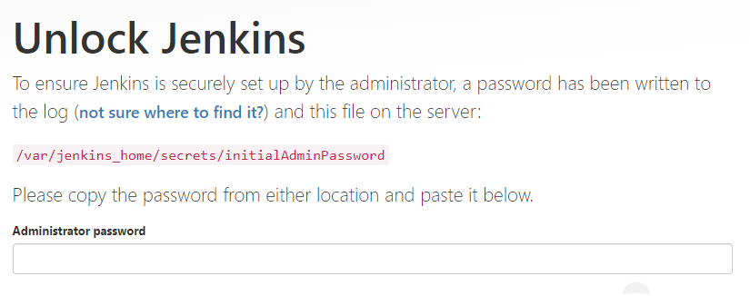

This token was provided on terminal that was used `docker compose up`.


or

```console
jenkins_1    | Please use the following password to proceed to installation:
jenkins_1    |
jenkins_1    | 7efed7f025ee430c8938beaa975f5dde
```

Just copy your _Jenkins_ token and paste it.

### Install plugins

In the next page select **Select plugins to install**

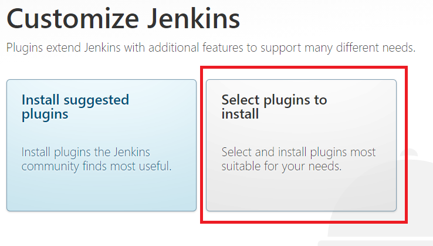

Then in the top of the page, select `none`, to deselect all _plugins_.


Then search for `git` and `pipeline`, and select both.


### Finish Jenkins setup

In the final step, just confirm Jenkins URL: `http://localhost:8080`.


---

## Setup SonarQube

To access `SonarQube`, open your browser and type `http://localhost:9000`.

Use this credentials in your first login.

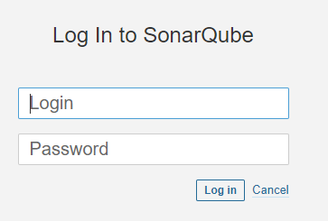

**login: `admin`**
**password: `admin`**

After that, you will be able to change the password.

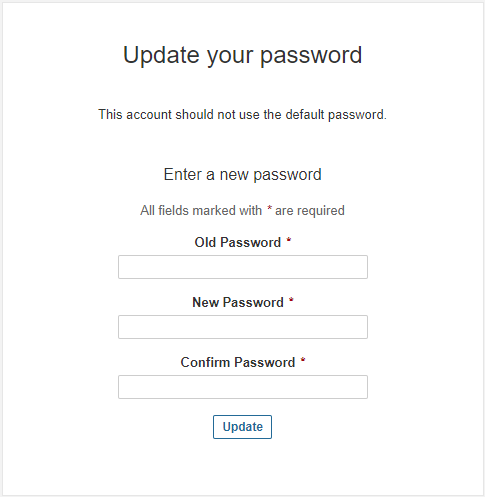

---

## Add SonarQube on Jenkins

[Install plugins](#install-plugins) | [Setup SonarQube Scanner](#setup-sonarqube-scanner) | [Setup NodeJs](#setup-nodejs)

### Install plugins

In your `Jenkins` (http://localhost:8080), go to **Manage Jenkins > Manage Plugins > Available**


Search for _sonar_ and select the **SonarQube Scanner**.


Then search for _node_, and Select the **NodeJs Plugin**


Click **install without restart**.


Once `SonarQube Scanner` and `NodeJs Plugin` is installed,let's configure it!

### Setup SonarQube Scanner

Go to **Manage Jenkins > Configure system**


Scroll down and find **SonarQube servers** section and click to `Add SonarQube` button.


 Set **Name** for the server. The **Server URL** will be `http://sonarqube:9000`. Then click to **save** on bottom of the page.


Now, go to **Manage Jenkins > Global Tools Configuration**


scroll down and find **SonarQube Scanner**, click to `Add SonarQube Scanner`. The **name** is `SonarQubeScanner` and select any version you want.

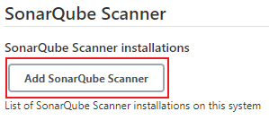


### Setup NodeJs

Now, go to **Manage Jenkins > Global Tools Configuration**


Scroll down and find **NodeJs**, click to `Add NodeJs`, the **name** is `NodeJs`.


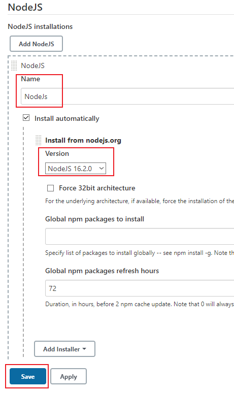

---

## Add Jenkins on SonarQube

In your `SonarQube`, go to **Administration > Configuration > Webhooks**


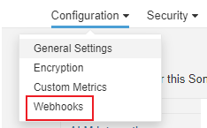

Click on `Create`


The **Name** is `Jenkins` and the **URL** is `http://jenkins:8080/sonarqube-webhook/`.

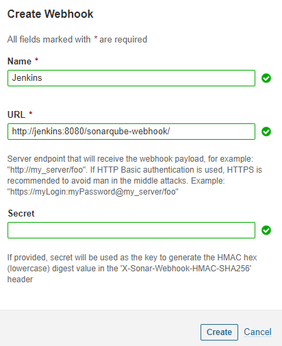
---

## Setup Sonar Project Properties

In the root of your application, you need to create a `sonar-project.properties`.

For more info, access [SonarQube Docs](https://docs.sonarqube.org/latest/analysis/scan/sonarscanner/).

```properties
sonar.projectKey=your-application
sonar.projectName=Your Application

sonar.sources=.
sonar.sourceEncoding=UTF-8
sonar.scm.disabled=true
```

---

# Create Jenkins Job and Run

To create a new _Job_, we'll click on `New Job` | `New Item`

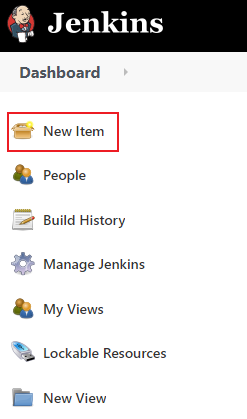

Then set a name of Job, and select **Pipeline**, then click in `Ok`.


Scroll down and find **Pipeline**, select `Pipeline script` and use this script:

```
pipeline {
    agent any
    
    tools {nodejs "NodeJs"}

    stages {
        stage('Clone sources') {
            steps {
                git branch: 'main', url: 'https://github.com/Pragnesh89/Nodejs_app.git'
            }
        }
    
        stage('SonarQube analysis') {
            environment {
                SCANNER_HOME = tool 'SonarQubeScanner';    
            }
            
            steps {
                
                withSonarQubeEnv('SonarQube') {
                    sh "${SCANNER_HOME}/bin/sonar-scanner"
                }
            }
        }
    }
}
```

Then save it


and click `Build Now`.

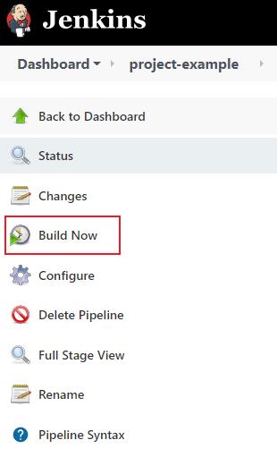

---

## SonarQube access token for Jenkins

[Generate SonarQube token](#generate-sonarqube-token) | [Add token on Jenkins](#add-token-on-jenkins)

### Generate SonarQube token

To enable Jenkins connect to SonarQube, we need to create a token for Login.

Open your SonarQube (`http://localhost:9000`).

Click on your user profile, and select `My account`.

.

Then click on `Security`.


On `Token`, we'll generate a new token.

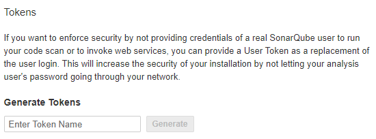

On the **Token name**, you can put any name you want, for this example, we'll use `example`.

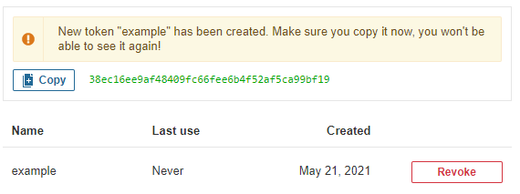

Copy this token and now we'll put it on **Jenkins**

### Add token on Jenkins

On your **Jenkins** (`http://localhost:8080`)

Go to **Manage Jenkins > Configure system**


Scroll down and find your **SonarQube Server**

On **Server authentication token**, click on `Add`


Then select `Secret text` on **kind**


The secret is the token was generate on **SonarQube** and the **ID** is the **name** of the token, in this example we'll use `sonarqube-token`, then click to `Add`.


Now select `sonarqube-token` on **Server authentication token**,then click to **save**.

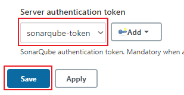
